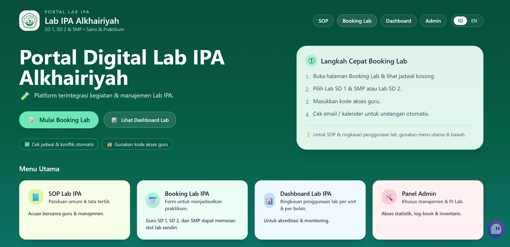
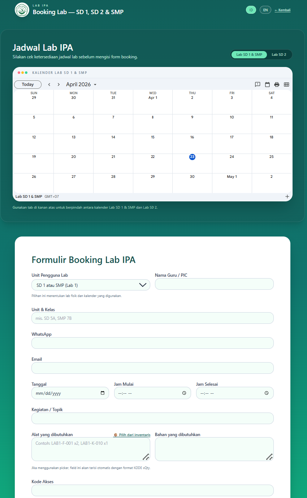
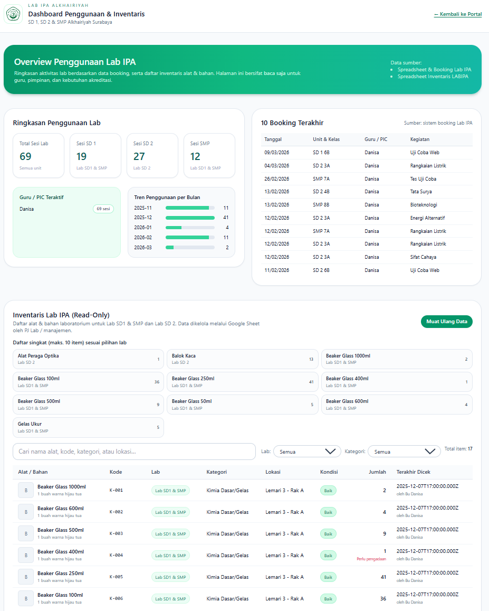

# Science Lab Management System

A full-stack system designed to support **real-world school laboratory operations**, including booking, inventory tracking, and administrative workflows.

This project was developed as part of a **practical implementation in a school environment**, focusing on reliability, usability, and operational clarity rather than just demonstration.

---

## Why this project exists

In many schools, laboratory activities are still managed manually:

- schedules overlap  
- inventory usage is not tracked clearly  
- reporting is difficult  
- coordination between teachers and lab managers is inefficient  

This system was built to solve those problems by introducing a **structured, digital workflow**.

---

## What the system does

### 1. Lab Booking
Teachers can:
- view availability
- book lab sessions
- receive confirmation via email/calendar

The system automatically:
- checks schedule conflicts
- prevents overlapping usage
- records all booking data

---

### 2. Operational Dashboard
Provides visibility into:
- lab usage patterns
- activity distribution
- usage by unit (SD / SMP)
- monthly trends

This supports:
- internal monitoring
- reporting
- accreditation preparation

---

### 3. Inventory Management
Tracks:
- equipment data
- quantities and condition
- storage location

Supports:
- updates and maintenance records
- structured inventory organization

---

### 4. Borrow / Return Workflow
Implements a simple transaction system:

- items can be borrowed with a reference ID  
- returns are tracked against the same reference  
- status is maintained (requested, borrowed, returned)  

This introduces **traceability**, which is usually missing in manual systems.

---

### 5. Admin & Log System
Admin users can:
- review all bookings
- manage inventory
- track historical records
- generate log-book outputs

---

## System Design

### Frontend
- React + TypeScript
- Component-based structure
- Bilingual interface (Indonesian / English)

### Backend
- Google Apps Script (server logic)
- Google Sheets (data storage)
- Google Calendar (schedule management)
- Gmail (notifications)

### Design Decision

Instead of using a traditional backend stack, this project uses **Apps Script + Google ecosystem** to:

- reduce infrastructure overhead  
- simplify deployment in a school environment  
- integrate directly with tools already used by staff  

---

## Screenshots

---

## Configuration (Public Version)

This repository uses placeholder values.

To run the system:

### Frontend

Create `.env`:

VITE_BOOKING_ENDPOINT=YOUR_APPS_SCRIPT_URL
VITE_LAB_CALENDAR_URL_SD1_SMP=YOUR_URL
VITE_LAB_CALENDAR_URL_SD2=YOUR_URL

### Backend

Set Apps Script `ScriptProperties`:

SPREADSHEET_ID
INVENTORY_SPREADSHEET_ID
LAB_CALENDAR_ID_SD1_SMP
LAB_CALENDAR_ID_SD2
ACCESS_CODE
ADMIN_KEY

---

## What this project demonstrates

This is not just a UI project. It demonstrates:

- system-level thinking  
- workflow design for real users  
- frontend–backend integration  
- data modeling using Google Sheets  
- operational automation (calendar + email)  
- handling of real-world constraints (non-technical users, limited infrastructure)

---

## Context

Developed for a school laboratory environment with:

- multiple labs  
- multiple education levels (SD / SMP)  
- shared resources  
- administrative reporting needs  

---

## Author

Danisa  
M.Sc. Electrical Engineering — Biomedical AI